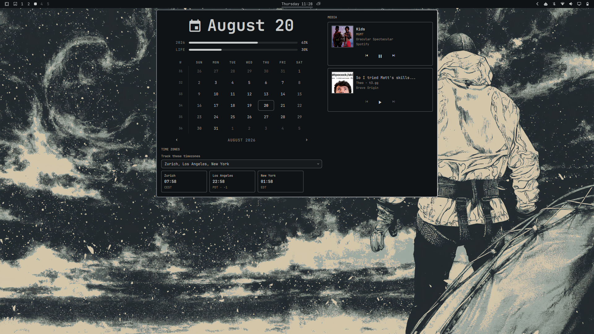

# Omaview

A calendar-based Omarchy bar clock with a combined popup for calendar navigation,
MPRIS media controls, and selectable IANA timezones.

This plugin is derived from Omarchy's built-in clock plugin and is intended for
the Omarchy shell.



## Features

- Calendar view with month navigation and the existing clock-format cycling.
- One media card per detected MPRIS player, including Spotify, browser media,
  and other MPRIS-compatible players.
- Track title, artist, album art, player name, and previous/play-pause/next
  controls when the player exposes them.
- Searchable IANA timezone selection with persistent selected zones.
- A compact horizontal row of selected timezone cards below the calendar.
- The system's local time is not repeated in the timezone section; only selected
  custom timezones are shown.

## Requirements

- Omarchy with the Quickshell-based shell.
- Omarchy's built-in `omarchy.media` service.
- Bash, coreutils `date`, `timedatectl`, and `jq`.
- Browser media must be exposed through MPRIS to appear in the popup.

No separate Spotify or YouTube integration is included. Media visibility and
controls depend on what each player exposes through MPRIS.

## Installation

Replace the placeholder repository URL with your public GitHub repository:

```sh
omarchy plugin add https://github.com/Manas-Kenge/omaview.git --enable
```

## Development and validation

From the plugin repository root:

```sh
omarchy plugin validate .
qmllint -I "$OMARCHY_PATH/shell" BarWidget.qml Panel.qml MediaSection.qml TimezoneSection.qml
bash -n *.sh
```

Click the clock to open the popup. Right-click cycles the existing clock format;
middle-click keeps Omarchy's existing timezone picker behavior. Selected custom
timezones are stored on this widget's bar entry in `shell.json` and survive a
shell reload.

## Removal

```sh
omarchy plugin remove io.github.manas-kenge.omaview
```

## Security and permissions

Omarchy shell plugins run with the permissions of the user session and are not
sandboxed. This plugin's scripts invoke standard local commands for timezone
data, while media access is provided by Omarchy's existing media service.

The repository URL and plugin ID use the `Manas-Kenge` GitHub namespace.
